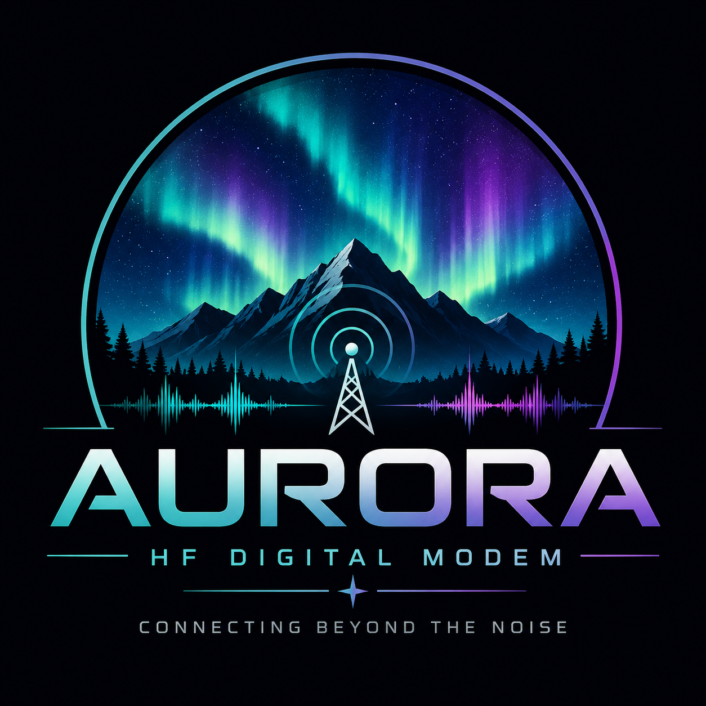

<p align="center">
  
</p>

Platform installer instructions are documented in [docs/building.md](docs/building.md).

# Aurora

**Project ID:** AURORA-HF-MODEM-2026

Aurora is a new digital-modem research project exploring reliable,
weak-signal communication under real-world HF propagation conditions.

## UPDATES — August 24, 2026

- Promoted the responsive PySide6 operator interface on macOS, Linux, and
  Windows. The Tkinter interface remains an explicit compatibility fallback.
- Added persistent Station ID, CAT Control, and Audio setup, including named
  Hamlib radios, dockable panels, Dark/Amber/Green themes, and Enter-to-send.
- Added live 100–3000 Hz radio-audio spectrum and compact waterfall displays,
  profile-bounded TX/RX tuning, and simultaneous CRC-gated decoding.
- Bundled pinned Hamlib and added DMG, DEB, RPM, and Inno Setup build workflows.
- Added periodic OFDM payload pilots, bounded clock-drift tracking, enforced
  transmit-audio linearity limits, and seeded bootstrap characterization.
- Expanded the automated regression suite to 247 tests.

- Replaced Aurora's unreleased single-carrier primary waveform with a
  provisional adaptive cyclic-prefix OFDM physical layer. It selects bounded
  500 Hz, 2.3 kHz, or 2.8 kHz profiles from measured channel conditions, with
  500 Hz as the safe fallback.
- Propagated PortAudio callback overflow and underflow status into the
  continuous receiver so partial state is discarded after a confirmed input
  discontinuity.
- Preserved unconsumed audio after successful continuous decoding, allowing
  multiple complete frames in one input block to be recovered.
- Added a bounded, CRC-gated BPSK phase-inversion fallback that recovers the
  published `A085` transient-failure capture.
- Added a deterministic, resumable, parallel continuous-receiver validation
  command and completed 10,000 matched noise-only trials with zero false
  decodes. The 95% Wilson upper bound is approximately 0.0384%; this is not an
  operational claim.
- Added a real-time, audio-only loopback workflow to the Tkinter interface.
  Aurora can simultaneously play a waveform, capture the routed input, decode
  the message, validate its CRC, and retain WAV and structured session
  diagnostics without activating CAT, PTT, or RF.
- Added PortAudio host-interface awareness, compatible device-pair filtering,
  and automatic preference for an available VB-CABLE route.
- Completed output-level calibration from 25% through 90% without clipping or
  decode failures.
- Completed 348/349 CRC-confirmed VB-CABLE deliveries, including a 240/240,
  approximately 49-minute stability campaign. The sole transient failure passed
  five consecutive exact retries.
- Published paired WAV evidence for the transient `A085` failure and a
  successful exact retry under `tests/fixtures/audio/`.
- Improved Deep receiver acquisition, clock search, selective-fading recovery,
  and candidate-aware normalized time diversity. The latest promoted offline
  campaigns delivered 39/40 severe-composite frames and 26/40
  strong-selective-fading frames at the provisional -24 dB research point.
- Completed 10,000 matched-path, two-observation noise-only trials with zero
  false decodes. The 95% Wilson upper bound is approximately 0.0384% for that
  offline Gaussian-noise model.
- Added a bounded fixed-geometry continuous audio receiver with arbitrary block
  handling, CRC-confirmed events, discontinuity counters, and UI controls.
- Passed the first persistent-stream VB-CABLE frame and the first provisional
  Deep research audio loopback frame.
- Added seeded narrowband-tone and correlated colored-noise channel models. A
  strong combined-interference screen delivered 94/100 Deep frames at the
  provisional -24 dB point and 0/300 matched noise/interference false decodes.

These are development results, not an over-the-air protocol, sensitivity
guarantee, or operational false-decode claim. Physical sound-device,
recorded or generated real-world interference, and controlled radio-channel
validation remain required.

## Development documentation

- [Current development status](docs/development_status.md)
- [Continuous audio receiver architecture](docs/continuous_audio_receiver.md)
- [Deep weak-signal mode research](docs/deep_mode_study.md)
- [Performance targets and acceptance boundaries](docs/performance_targets.md)
- [SNR definitions and measurement conventions](docs/snr_conventions.md)
- [Published real-audio validation fixtures](tests/fixtures/audio/README.md)

## Project status

Aurora is in active development. The repository provides the foundational
project structure, adaptive OFDM modem research, a responsive operator
interface, live radio-audio monitoring, multi-frequency decoding, and
audio-only validation workflows. Aurora includes bundled Hamlib CAT/PTT
control, but never connects to a radio or opens audio automatically.

## Design goals

- Adaptive 500 Hz, 2.3 kHz, and 2.8 kHz occupied-bandwidth profiles
- Strong weak-signal performance and HF robustness
- Adaptive operation and efficient synchronization
- Forward error correction
- Clear diagnostics for synchronization, signal quality, offsets, CRC results,
  and FEC corrections
- A modular architecture suitable for long-term expansion

Aurora's active weak-signal research target is CRC-confirmed delivery of a
20-byte Deep-mode reference message at -24 dB SNR in a 2,500 Hz reference
bandwidth, with a desired total transmission time of 30 to 40 seconds or less.
The initial realistic-HF target is -21 to -22 dB. These are development
objectives, not current capability claims. See `docs/performance_targets.md`.

## Technology

- Python 3
- PySide6 for the responsive cross-platform desktop interface
- Tkinter retained temporarily as a compatibility interface
- NumPy for numerical processing
- SciPy only where it provides a clear DSP advantage

## DSP core

The initial bit-level DSP core provides:

- Versioned binary framing with payload length and flags
- CRC-16/CCITT-FALSE integrity checking
- Additive bit scrambling for spectral whitening
- Rate-1/2 convolutional FEC with hard-decision Viterbi decoding
- Normalized BPSK symbol mapping for Aurora OFDM subcarriers
- A composable payload-to-symbol and symbol-to-payload pipeline

The generic bit-level core remains independent of waveform filtering and
automatic gain control.

Native variable-length Aurora frames carry chat without AX.25 overhead or
fixed-size padding. A protected bootstrap signals exact geometry, bandwidth,
constellation/FEC, interleaver, payload type, and frame ID. Separate AX.25 UI
frames carry callsign, grid, GPS position, altitude, and short station metadata
only when needed. Compact native reception reports can refer to an earlier
frame ID. See [the native transport](docs/native_transport.md) and
[AX.25 station-data definition](docs/ax25_transport.md).

The primary waveform maps protected constellation values across a provisional
12 kHz cyclic-prefix OFDM signal. Repeated training blocks provide acquisition,
residual carrier-offset measurement, and per-subcarrier equalization. It is
used by offline tests, one-shot audio loopback, and fixed-geometry continuous
receive tests. None of these paths controls a radio. See
[the OFDM mode definition](docs/ofdm_mode_definition.md).

The offline robustness harness adds deterministic real-audio AWGN, timing
displacement, sample-clock error, multipath, fading, impulsive noise, and level
variation. Its results use the `audio_sim` domain so they remain distinct from
symbol-domain measurements. A small logged check can be run with
`.\.venv\Scripts\python.exe -m modem.audio_robustness`; it remains offline and
does not initialize audio or radio hardware.

An additional `extreme_research` study compares acquisition-only BPSK and
continuous-phase 4-GFSK candidates at 7.8125 symbols/s. It calculates a
theoretical rate-1/8 coding budget but deliberately provides no such encoder or
decoder and reports no payload success. Run it with
`.\.venv\Scripts\python.exe -m modem.extreme_mode_study`. See
`docs/extreme_mode_study.md` for assumptions and limitations.

The former -30 dB exploration is retained for acquisition research but is no
longer an active product requirement. It provides no payload or CRC result.

The extreme acquisition CLI supports deterministic AWGN, combined HF, fading,
multipath, clock-error, and impulsive-noise profiles. Signal and noise-only
trial counts are independent, cancellation preserves completed counts, and
Wilson intervals expose the uncertainty of small studies. These remain
acquisition-only simulations.

The extreme receiver can also compare discrete sample-clock hypotheses while
accounting for their induced passband carrier shift. A cancellable standard ppm
sweep reports selected clock error and explicitly fails complete acquisition
when the injected error is not represented by the search grid.

## Receiver

The initial receiver operates on complex baseband samples and provides:

- Normalized known-preamble acquisition and sync confidence
- Frequency-offset estimation from preamble phase slope
- Complex carrier-offset correction
- Interpolated Gardner symbol-timing recovery
- BPSK soft log-likelihood demapping for Aurora receive paths
- Soft-input Viterbi FEC decoding
- Sync, SNR, frequency-offset, and timing diagnostics

Aurora now has complete development audio-to-message paths for known frame
geometry: one-shot loopback and a bounded continuous multi-frequency receiver.
Unknown-length framing, full over-the-air interoperability validation,
automatic gain control, and mid-frame timing repair remain incomplete.

## Audio

Aurora provides a modular audio layer with:

- Immutable NumPy floating-point sample buffers
- Uncompressed 8-, 16-, 24-, and 32-bit PCM WAV import
- Signed 16-bit PCM WAV export
- Blocking or asynchronous buffered playback
- Input, output, and full-duplex real-time streams
- Audio device discovery, host-interface compatibility filtering, and
  preferred virtual-cable pairing

Real-time audio uses a 12 kHz, mono, 1,024-frame default configuration. These
values are centralized in `config/settings.py` and can be replaced as modem
waveform requirements evolve.

## Radio integration

The radio layer provides:

- Serial-port discovery and a thread-safe ASCII command transport
- Kenwood-style CAT frequency, mode, and PTT commands
- CAT, RTS, and DTR PTT methods with automatic release support
- Bundled Hamlib `rigctld` and operator-readable radio model selection
- SQLite contact records with UTC timestamps and operating details

Radio control is disconnected at startup. **PTT Control** is enabled by
default, but SEND remains unavailable until the operator connects Hamlib.
Aurora keys PTT only for an explicit SEND action and releases it after playback
or an error.

## Spectrum and waterfall

Aurora includes a Hann-windowed FFT analyzer, live spectrum, and compact
bounded waterfall driven only by the selected radio audio input. Clicking the
Spectrum selection changes the shared TX/RX audio center within bounds that
keep the complete selected bandwidth inside the 100–3000 Hz working passband.
Selected-frequency traffic appears in Messages; other CRC-valid decoded
traffic appears in the independent Other Signals dock. Aurora does not
generate a pretend spectrum or open audio automatically.

## Operator interface

The compact main window shows radio frequency, radio mode, station callsign,
occupied bandwidth, synchronization, SNR, frequency offset, timing, CRC, and
FEC status. Messages and Other Signals are independently dockable and
resizable. Select **SEND** or press Enter to transmit.

The **Setup** menu provides Station ID, CAT Control, and Audio tabs. These
contain callsign/grid, named radio model, CAT serial and `rigctld` settings,
PTT Control, radio audio devices, and live receiver controls. Aurora remembers
operator, CAT, audio, tuning, bandwidth, theme, window, and dock settings using
the platform-native settings store. Dark, Amber, and Green themes are
available.

Aurora uses asynchronous frame acquisition rather than mandatory UTC transmit
slots. Each OFDM frame carries its own synchronization and training sequence,
so ordinary receive and SEND operation do not require an FT8-style timer.
Future scheduled CQ, beacon, or channel-access features may use optional
timers without making clock synchronization mandatory.

## Development validation

The retained Tkinter compatibility interface includes offline codec, channel,
and audio-loopback development controls. These exercise Aurora framing,
scrambling, FEC, OFDM mapping, soft decoding, and CRC validation without
activating CAT, PTT, or RF.

The channel test adds deterministic Clean, Moderate HF, Weak Signal, and Severe
presets. It can run one to 1,000 symbol-domain frames with injected AWGN and
carrier rotation, reporting frame success, CRC outcomes, pre-FEC channel bit
errors, recovered errors, and processing time. **RUN 100 FRAMES** provides a
repeatable threshold check. Frequency and SNR values in this test are injected,
not receiver estimates. This specific symbol-domain test does not exercise
timing impairment; timing is covered by separate waveform and continuous-audio
tests.

Each application run creates a structured debug log named
`aurora_test_session_YYYYMMDD_HHMMSS_ffffff.log`. Test starts, results, errors,
injected conditions, frame statistics, bit-error counts, and timing information
are flushed immediately. Local codec and symbol-domain benchmark events record
message length rather than content. Audio-loopback and continuous-receive events
currently record transmitted or received test text for reproducibility. The
latest session log can be reviewed after testing without exporting data from
the interface. Source runs use the project `logs/` directory. Installed builds
use a writable per-user location: the XDG state directory on Linux,
`~/Library/Logs/Aurora` on macOS, or `%LOCALAPPDATA%\Aurora\logs` on Windows.

The **Channel Results** tab also provides a cancellable robustness sweep. Its
default range is -24 through +10 dB in a 2,500 Hz reference bandwidth, using
200 frames per point across four deterministic seeds at 31.25 symbols/s. It
reports Es/N0, BER, FER, net payload throughput, processing time, and a 95%
frame-success confidence interval. The measurement convention and the intended
-22 dB robust-mode target are defined in `docs/snr_conventions.md`.

Aurora's independent DSP pipeline includes a deterministic block interleaver
between convolutional FEC and symbol mapping. The documented robust simulation
mode selects BPSK at 31.25 symbols/s, rate-1/2 constraint-length-7 convolutional
FEC, and a fixed 16-column interleaver. The receiver applies the inverse
permutation before hard- or soft-input FEC decoding. The simulation UI retains
an explicit interleaver-off override for controlled A/B tests.

The selection is documented in `docs/mode_definition.md`. It is a development
definition for reproducible simulation and does not claim an over-the-air
protocol, signaling format, or interoperability specification.

## Project structure

```text
Aurora/
|-- audio/       Audio input and output
|-- config/      Central application settings
|-- docs/        Project documentation
|-- dsp/         Digital signal-processing algorithms
|-- gui/         PySide6 operator UI and Tkinter compatibility UI
|-- logs/        Rotating application logs (created at runtime)
|-- modem/       Modem and protocol logic
|-- packaging/   PyInstaller and native installer definitions
|-- radio/       Hamlib, CAT, PTT, serial ports, and contact records
|-- tests/       Automated tests
|-- util/        Shared utilities and logging setup
|-- waterfall/   Waterfall and spectrum displays
|-- Aurora.sln   Visual Studio solution
`-- README.md    Project overview
```

## Development setup

Create a virtual environment if one does not already exist:

```powershell
python -m venv .venv
```

Activate it in PowerShell:

```powershell
.\.venv\Scripts\Activate.ps1
```

Install the required packages:

```powershell
python -m pip install -r requirements.txt
```

Run the current desktop shell with:

```powershell
.\.venv\Scripts\python.exe .\aurora.py
```

Aurora prefers the PySide6 interface. During the transition, the previous
Tkinter interface remains available from a source checkout with
`aurora.py --tk`; self-contained installers include the supported Qt UI only.

The primary interface displays only samples captured from the selected radio
audio input. Aurora bundles and starts its own Hamlib `rigctld` service by
default; operators do not need to install Hamlib. An external local or network
service remains an advanced option. Radio frequency and mode polling are
asynchronous. PTT Control defaults to enabled, while SEND remains blocked until
Hamlib is connected. See
[the bundled Hamlib design](docs/bundled_hamlib.md).

## Native builds

Build on each target operating system because PyInstaller does not
cross-compile native applications:

```text
macOS:   ./build.macos.sh
Ubuntu:  ./build.ubuntu.sh
Fedora:  ./build.fedora.sh
Windows: build.exe.bat
```

Each workflow runs the tests, prepares private Hamlib, builds and verifies a
self-contained application, and produces a DMG, DEB, RPM, or Inno Setup
installer beneath `dist/installer/`. See [the build guide](docs/building.md)
for prerequisites and release controls.

Aurora records startup, shutdown, and future operational messages in
`aurora.log` in that per-user log directory. Log files rotate automatically to
limit disk usage.

Run the automated tests with:

```powershell
.\.venv\Scripts\python.exe -m unittest discover -s tests -v
```

## Deep payload research

Aurora includes an offline, deterministic 20-byte payload feasibility study for
the -24 dB Deep objective. It compares a rate-1/2 convolutional baseline with
provisional rate-1/4 repeated-bit candidates, soft combining, and fixed
interleaving. It exercises acquisition, carrier and clock hypotheses, audio
channel impairments, soft decoding, and CRC validation without opening audio or
radio hardware.

The design and measurement limits are documented in
`docs/deep_mode_study.md`. These experiments do not define or claim an
over-the-air protocol.

The current implementation status, completed validation, end-of-day
conclusions, and prioritized next steps are recorded in
`docs/development_status.md`.

The operator UI also includes an audio-only real-time loopback test. It plays
an Aurora waveform through a selected output while capturing the selected
input, then performs synchronization, soft decoding, CRC validation, WAV
capture, and structured session logging. Compatible outputs are filtered by
PortAudio host interface, and an available virtual-cable pair is preferred.
This workflow never activates CAT, PTT, or RF control.

An extended VB-CABLE campaign has delivered 348 of 349 real-time audio frames,
including a 240/240 approximately 49-minute stability run. The sole failure was
a transient mid-frame symbol disruption and passed five exact retries. These
results validate the virtual audio path but do not replace physical sound-device
or controlled radio-channel testing.

Long campaigns use `modem.deep_validation.DeepValidationConfig` and
`run_deep_validation`. The runner supports deterministic batch ranges,
cancellation, confidence intervals, runtime measurements, optional traced peak
memory, carrier and clock grids, named HF profiles, and an optional
CRC-validated fading fallback. Research-only candidate-aware time diversity
retains bounded timing hypotheses and combines reliability-normalized soft
observations.

The current CRC-arbitrated multi-observation research receiver delivered 39/40
severe-composite and 26/40 strong-selective frames at the provisional -24 dB
point. A matched-path 10,000-trial Gaussian-noise campaign completed with zero
false decodes; its 95% Wilson upper bound is approximately 0.0384%. This does
not cover real receiver noise, recorded interference, physical sound hardware,
or radio artifacts, so no on-air sensitivity or zero-false-decode claim is
made.

## Versioning

Aurora uses semantic versioning. The first development release will begin in
the `0.x` version range.
